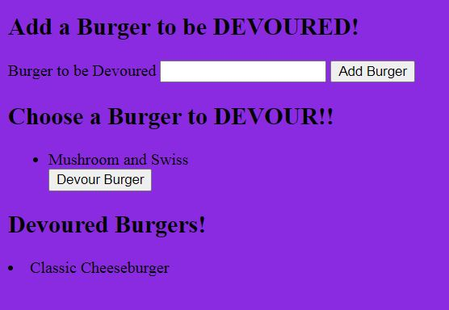

# burger

## Description

The Burger Logger allows you to add a burger of your choice that you would like to devour at some point.  Once you add a burger you can devour it at any time amongst a selection of burgers if there are more than one.   The Burger that you chose to devour is then logged as devoured.     

## Technologies
The Burger Logger was created using node.js and the dependencies used were: mySQL to use/write data to and from the database, express to route the database info to/from the user page and express-handlebars to create a template that the user will see and interact with.    

## Usage
Type in the name of a burger that you would like to add to the Burgers to be Devoured section and click Add Burger.  Then choose a burger that you would like to devour or add to the devoured section by clicking Devour Burger.  

## Author
Joshua Guillen

### GitHub Profile: 
https://github.com/guillenjoshua

### Email Contact: 
guillenjoshua@gmail.com

## IMG

